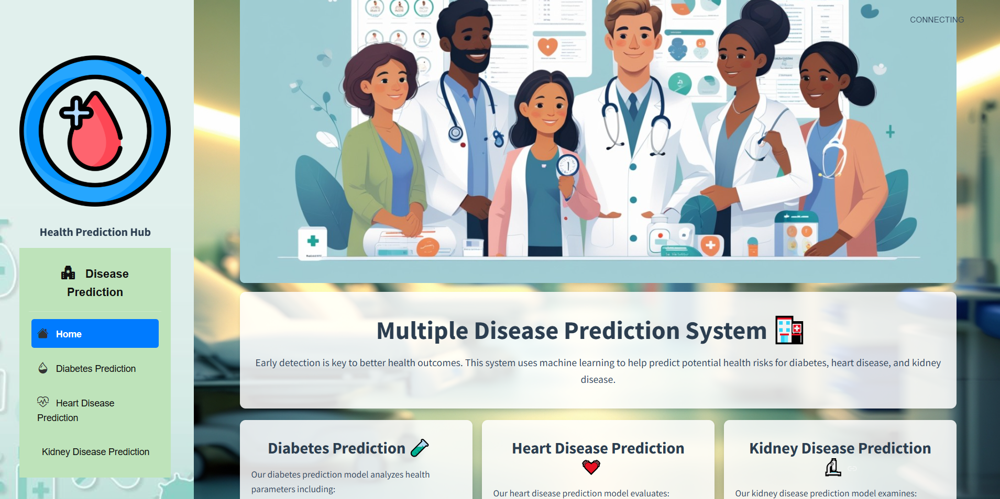

🧠 Multiple Disease Prediction using Machine Learning (Diabetes, Heart, Kidney)
A complete ML Ops project that predicts the likelihood of Diabetes, Heart Disease, and Kidney Disease based on patient health indicators. This system demonstrates end-to-end ML lifecycle: data ingestion, validation, training, evaluation, model deployment, and real-time inference.

🔍 Overview
The web-based application allows users to input clinical parameters (e.g., glucose level, creatinine, cholesterol, blood pressure) and receive instant disease predictions across three models:

Diabetes

Heart Disease

Kidney Disease

Each disease uses its own schema, preprocessing steps, and ML model, managed by a unified and modular backend.

🧱 Architecture
plaintext
Copy
Edit
                +----------------------+
                |   Streamlit Frontend |
                +----------+-----------+
                           |
                           v
         +-------------------------------+
         |      Prediction Pipeline      |
         |  (Preprocessing + Inference)  |
         +-------------------------------+
                           |
                           v
                +-------------------+
                |   Trained Models  |
                |   (from AWS S3)   |
                +-------------------+

      +--------------------------------------------+
      |   Model Training Pipeline (training.py)    |
      |                                            |
      | - Data Ingestion from MongoDB              |
      | - Schema Validation                        |
      | - Data Transformation                      |
      | - Model Training & Evaluation              |
      | - Conditional Push to AWS S3               |
      +--------------------------------------------+
⚙️ Key Features
Disease-wise modular ML pipelines

Schema-based validation and transformation

Performance-driven model pushing to AWS S3

Unified frontend for all disease predictions

Cloud-hosted model artifacts

Streamlit-based real-time user interface

🚀 Deployment
Data Source: MongoDB Atlas

Model Storage: AWS S3

Frontend: Streamlit (deployed on AWS EC2)

Model Inference: Python-based modular backend pipelines

CI: Manual or shell-scripted via Git/GitHub

🌐 Live Application
App URL: https://diabetespredictionmlopsproject-gyupmbyqqvr7exjhmwvyh7.streamlit.app/

🖼️ Screenshot of the deployed application:

🛠️ Tech Stack
Core: Python, Scikit-learn, Pandas, NumPy

Web App: Streamlit

Data Storage: MongoDB Atlas

Model Storage: AWS S3

Other Tools: PyYAML, Logging, Custom Exception Handling

📁 Project Structure
graphql
Copy
Edit
Multiple_Disease_Prediction/
│
├── app.py                     # Streamlit frontend
├── config/
│   ├── schema.yaml            # Feature and target definitions per disease
│   └── model.yaml             # Model file paths
│
├── src/
│   ├── components/            # Ingestion, validation, transformation, training
│   ├── cloud_storage/         # S3 utilities
│   ├── configuration/         # AWS and MongoDB connectors
│   ├── data_access/           # MongoDB access logic
│   ├── entity/                # Entity classes for config, artifact, estimator
│   ├── pipeline/              # Training and prediction logic
│   └── utils/                 # Utility functions
├── requirements.txt           # Project dependencies
├── setup.py
├── training.py                # Script to trigger training